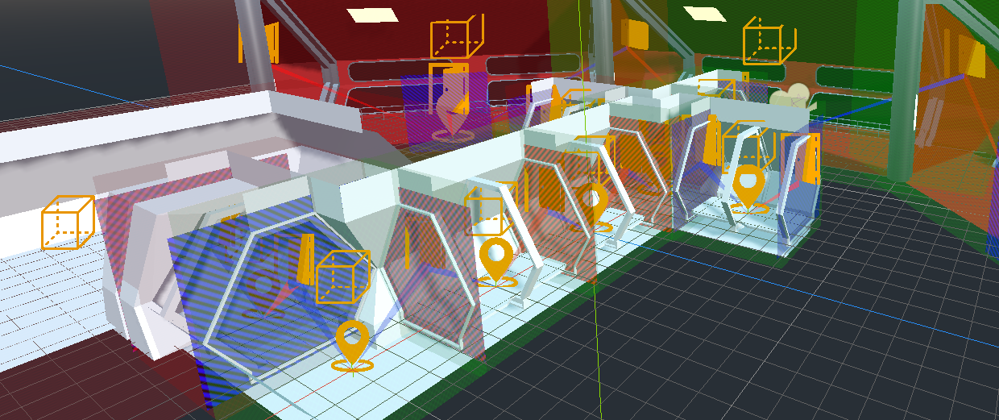

# dzPortals - bringing portals back to godot
Godot portals addon for rendering optimisation.

 

## What is a portals engine?
A portals engine is a 3D rendering optimisation technique where confined spaces get connected by virtual portals. Spaces that are not visible through a portal will be excluded from rendering. This can provide a significant reduction of draw calls and rendered polygons.
Read more here: https://en.wikipedia.org/wiki/Portal_rendering

## When to use?
Portal engines are mostly usefull for indoor scenes or outdoor scenes with many confined spaces like a narrow street scene. Also it can be mixed with outdoor scenes when entering buildings, dungeons or alike.

## How to use it?
Check out the docs. They provide installation notes, a basic explanation of components and api documentation.
* [Installation](docs/documentation.md#installation)
* [Basics](docs/documentation.md#basic-workings)
* [API](docs/documentation.md#api)

## In depth view on the algorithm
Wanna know more? [Check it out here](docs/indepth.md)

## Common Issues
- crashed when changing the SceneTree - fixed
- missing singleton reference - fixed

## Contributing
Please try and test it. Any issue report and suggestion are appreciated.

## To Do
* make gizmos pickable in the editor
* Fix the make zone to root problem.  
(i haven't found any way to make a node created by script to the new scene root)
