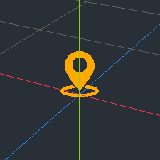

# dzPortals - Documentation

* [Installation](#installation)
* [Basics](#basic-workings)
* [API](#api)
 * [dzPortalsZone](#dzportalszone)
 * [dzPortalsArea](#dzportalsarea)
 * [dzPortalsGate](#dzportalsgate)

## Installation
Just download the project, unzip it and place the contents of the addons folder into the addons folder of your godot project directory.
Reload/load your project.
In godot goto project settings->addons and activate the dzPortals addon.
You're done.

## Basic workings
DzPortals works with 3 basic objects zones, areas and gates.

A zone defines a confined space that should be culled by the portals engine.
Areas define the volume of a zone. A zones volume can be defined by one or more areas.
Gates are the visual connections between zones.

## Zone
 
 Zone should containe all visual instances of the defining space. If the zone is culled it gets hidden and so do all of its children nodes.
  
### Properties:
* disabled: zone gets excluded from calculation. The zone will stay in its initial state until disabled = false is set
* blackList: Array of nodePath's. When the camera is in the zone ayy nodes defined in here will be immediately culled and excluded from any further processing.

## Area
Areas should enclose all of the visual instances in the zone. You can have as many areas linked to a zone as you like.

### Properties:
* shape: shape defines the volumetric body of the area. So far there are box, sphere and cylindrical shapes available.
* dimensions: the spacial extends of the shape
* margin: an margin applied to the shape
* zone: the zone it is used for
* blackList: Array of nodePath's. When the camera is in this area any nodes defined in here will be immediately culled and excluded from any further processing.
* disabled: area gets excluded from calculation.

## Gate
Gates should cover doorways, portals, windows etc. completly or else you will have pop in effects when looking around.
Gates have two sides, a blue side and a red side. The sides should be connected with the corresponding zones.
Gates can connect two zones via setting them directly or can be defined as magnetic. Magnetic gates have only one side connected with a zone. If they come close to another magnetic portal with similar properties they can connect and act as one portal. This is espacially usefull when you are building your scene with modular subscenes. You can then define the openings in the subscene and when putting it together in the main scene they  connect automaticly.

### Properties:
* dimensions: the sapcial extends of the portal
* do frustum check: uses anhanced visibility check with sligthly increased calculation effort
* blue zone: node Path to the zone on the blue side
* red zone: node Path to the zone on the red side
* is magnetic: this gate is magnetic and will connect to other magnetic gates. This option only apply when **only one** side is connected to a zone.
* auto magnetic: will automaticly connect to any nearby gate when moved in scene
* magnetic distance: the max distance for magnetic snapping
* magnetic angle: the max orientation offset for magnetic snapping
* magnetic dimension: the max difference of the gates dimensions for magnetic snapping
* magnetic gaze: the nodePath to the magnetic snapped gate
* disabled: gate gets excluded from calculation. The gate will not activate the zone connected to it. Usefull when a door, portal etc. is closed. When a visual instance is blocking the sight through the gate you can turn off the gate. This will prevent the zone behinde the gate to be rendered.

## dzPortals Inspector
On the bottom menu you find the dzPortlas Inspector with many usefull tools to help you build your portals  system.

### Stats
Here you see the impact of the portal optimisation.
* visible zones: zones that are visible, the others are not
* gates processed: the amount of gates that had to be calculated in the current frame
* clipped polys: the amount of polygons that are clipped through portals optimisation. This number shows only potential reduced polygons, this does not take in acount allready clipped polygons through frustum culling or any other culling/hiding optimization.
You have to hit "Refresh polygon count" first to aquire the total amount of scene polygons.
* processing time: the time it took to process all areas and gates

### Tools
Here you find a collection of usefull tools to make your scene ready for portals. This speeds up the work and make it more convenient.
* **CREATE**
  * Create zones for selected zones  
Will create zone for the every currently selected nodes. The selected nodes will be parented to the created zone. **Currently you cannot use this on the root node. You have to covert the zone to the root node manually if you want to do so.**
  * Create areas for selected zones  
 Will create a area for the selected zones. The area gets scaled to the extends of the inner nodes and connected to the zone.
  * Create zones and areas for selected zones  
 Combines both of the above
* **GATES**
   * Connect magnetic gates  
  Will provoke a magnetic connection of magentic gates to connect other magentic gates.
   * auto detec zones  
  Will try to find corresponding zones for the gates and assign them to the red and blue side.
* **AREAS**
  * Assign to parent zone  
 Will link areas to the there parent zone
  * Resize to zone  
 Will resize the area to the extends of the connected zone
* **ZONES**
  * auto blacklist zones  
 Will analyse the scene to further optimize the culling effect of gates. Any zone found to be invisble through corresponding gates will be put in the blackList therefore culled when entering this zone.
  * clear zone blacklists  
 Will clear the existing baclklist of the zones
 * execute only on selected nodes  
Any action taken will only be commited on selected nodes in the tree when this option is enabled. If not enabled actions will be taken on all corresponding nodes in the tree.
 
### Visibility
Gizmo visiblity can be toggled here.

## API
All of the feature of dzPortals can be accessed through scripting. 

### dzPortalsZone

#### Properties
**disabled** :bool  
*defaults to false*

#### Methodes
void **auto_blacklist()**  
*automaticly generates a blacklist of zones*

void **add_blackList( zone: dzPortalsZone )**  
*adds the zone to the blacklist*

void **remove_blackList( zone: dzPortalsZone )**  
*removes the zone from the blacklist*

#### Signals
**zone_entered**  
*whenever the camera entered the zone*

**zone_exited**
*whenever the camera exited the zone*

**zone_shown**  
*whenever the zone gets visible*

**zone_hidden**
*whenever the zone gets invisible*

### dzPortalsArea

#### Properties
**disabled** :bool  
*defaults to false*

**shape** :dzPortalsArea.STATE  
*defines the shape, can be SHAPE.box, SHAPE.sphere or SHAPE.cylinder*

**dimensions**: Vector3  
*defines spacial extends*

**margin**: Float  
*defines spacial margins*

**zone**: NodePath  
*the connected zone*

#### Methodes
bool **is_inside( Vector3 )**  
*Returns true if point is in volume*

void **assign_to_parent( )**  
*Connects this area to the parent zone*

void **resize_to_mesh( mesh:meshInstance )**  
*Resizes the area to the given mesh extends*

void **resize_to_zone( )**  
*Resizes the area to the extends of the connected zone*

#### Signals
**area_entered**  
*whenever the camera entered the area*

**area_exited**
*whenever the camera exited the area*

### dzPortalsGate

#### Properties
**disabled** :bool  
*defaults to false*

**dimensions**: Vector2  
*defines spacial extends*

**do_frustum_check** :bool  
*enables enhanced culling methode*

**is_magnetic** :bool  
*enables magnetic mode*

**auto_magnetic** :bool  
*enables auto connect to magnetic gates*

**magnetic_distance** :float  
*maximal distance to magnetic connections*

**magnetic_angle** :float  
*maximal angular offset to magnetic connections*

**magnetic_dimension** :float  
*maximal dimensional difference to magnetic connections*

**cornerPoints** :array of Vector3  
*all of the gates corner points in local space*

#### Methodes
int **get_side( Vector3 )**   
*returns dzPortalsGate.BLUE_SIDE when the point is on the blue side or else returns dzPortalsGate.RED_SIDE*

Plane **get_red_plane( )**   
*returns a plane repressenting the red side in global space*

voPlaneid **get_blue_plane( )**   
*returns a plane repressenting the blue side in global space*

void **set_magnetic_gate( dzPortalsGate )**  
*sets the magentic gate*

dzPortalsZone **get_magnetic_zone(  )**  
*gets the zone connected by the magnetic gate*

void **remove_magnetic_gate( dzPortalsGate )**  
*removes the magnetic gate if its dzPortalsGate*

void **auto_find_magnetic_gate(  )**  
*tries to connect to other magentic gates*

dzPortalsZone **get_red_zone(  )**  
*gets the red zone*

dzPortalsZone **get_blue_zone(  )**  
*gets the blue zone*

void **set_red_zone( dzPortalsZone )**  
*sets the red zone*

void **set_blue_zone( dzPortalsZone )**  
*sets the blue zone*

dzPortalsZone **get_other_zone( dzPortalsZone )**  
*gets the zone on the opposite side of dzPortalsZone from the gate*

void **auto_connect_zones( )**  
*tries to find corresponding zones and connects them*

